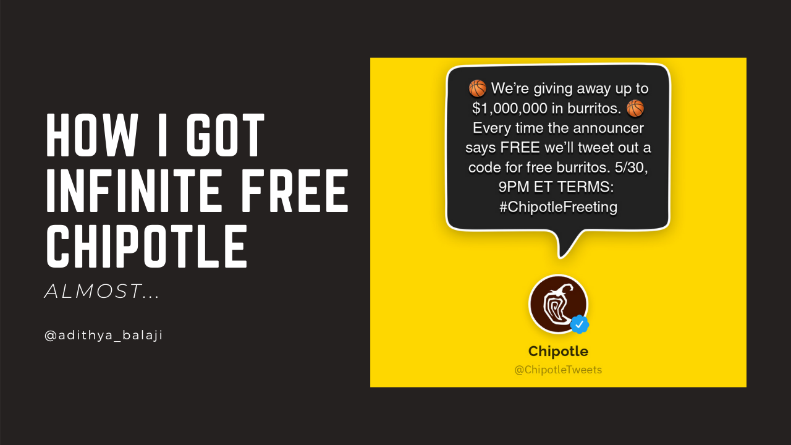
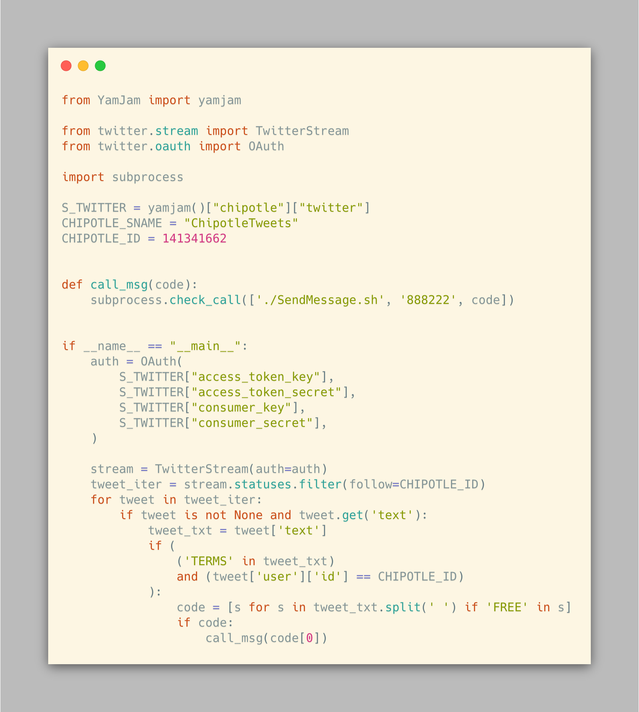
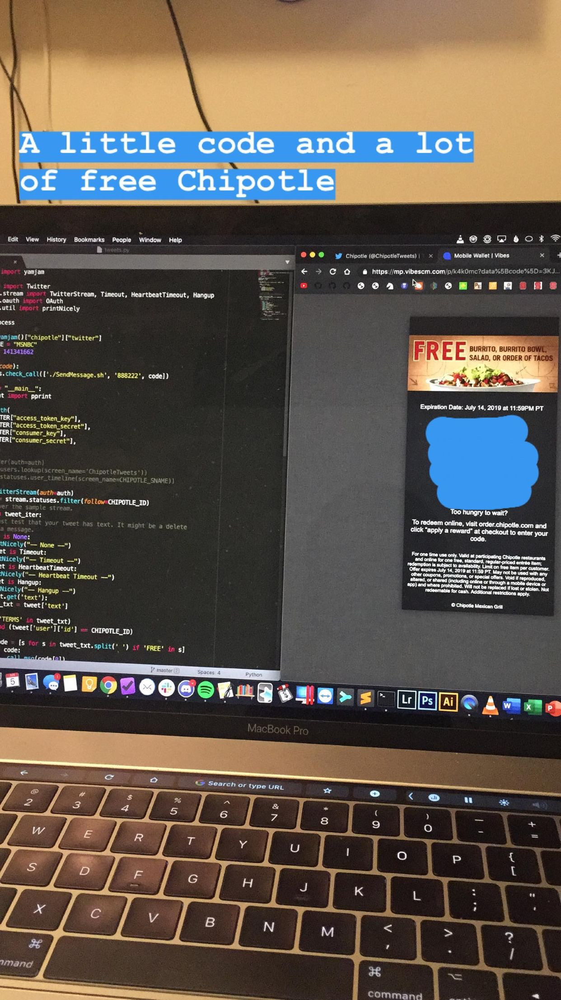

+++
title = "How I (almost) got infinite free Chipotle"
description = "A tale of trials, tribulations, and most importantly burritos."

[extra]
highlight = true
+++

<!-- markdownlint-capture -->
<!-- markdownlint-disable -->
<iframe loading="lazy" width="100%" height="166" scrolling="no" frameborder="no" allow="autoplay" src="https://w.soundcloud.com/player/?url=https%3A//api.soundcloud.com/tracks/1103970979&color=%23ff5500&auto_play=false&hide_related=false&show_comments=true&show_user=true&show_reposts=false&show_teaser=true"></iframe>
<a href="https://soundcloud.com/adithyabsk" title="Adithya" target="_blank" style="color: #cccccc; text-decoration: none;">Adithya</a> · <a href="https://soundcloud.com/adithyabsk/how-i-almost-got-infinite-free-chipotle" title="How I (almost) Got Infinite Free Chipotle" target="_blank" style="color: #cccccc; text-decoration: none;">How I (almost) Got Infinite Free Chipotle</a>

<!-- markdownlint-restore -->

It's
[Game 3 of the NBA finals](https://www.basketball-reference.com/boxscores/201906050GSW.html),
the Raptors are up 2-1 as Steph Curry and Kawhi Leonard face off in the Oracle
Arena. I was having a face-off of my own: me vs Chipotle's free burrito promo
codes.

As a huge fan of Chipotle, I couldn't wait to get my hands on some free burrito
coupons. As a college student, Chipotle happened to be part of my food pyramid.
The NBA promo event was paying me in burritos for something I already enjoyed
watching.

<!-- markdownlint-disable -->

<!-- markdownlint-enable -->

For those not in the know, Chipotle [ran a promotional campaign](https://twitter.com/ChipotleTweets/status/1133785740645687301)
during the 2019 NBA playoffs to get more people into their stores. Each time the
announcer said the word "free" (as in free throw) during the game, the
@ChipotleTweets account would tweet out a code that would result in a free
burrito coupon for the first 5,000 people to send it to an account.

Sounds easy enough, right? Wrong. Apparently, although my reaction times may be
fast, they were not fast enough. Attempt after attempt, I had no luck. Game 1
passed and so had Game 2. I was frustrated.

It was time to bring out the big guns. As Tom Scott would say, it was time to
[bodge together a script](https://www.youtube.com/watch?v=lIFE7h3m40U) to save
the day. There were two parts to the equation, extracting the code from Twitter
and sending it via SMS to the Chipotle Number.

The first part was pretty straightforward. Throw on the social network
soundtrack and write a quick script to extract the codes from tweets.
[Who needs Perl](https://www.youtube.com/watch?v=BPazh2kDdvA&t=215s), when
you've got Python? [Cloc'ing](https://github.com/AlDanial/cloc) at just
[29 lines of code](https://github.com/adithyabsk/chipotle_freeting/blob/main/tweets.py),
it's nothing to write home about, but it gets the job done. We set up a
[Twitter API credential](https://developer.twitter.com/en/docs/authentication/oauth-1-0a/obtaining-user-access-tokens)
and use a [python twitter library](https://github.com/python-twitter-tools/twitter)
(now outdated) to parse the firehose of tweets for what we need.

In terms of actually extracting the codes, I started out with a more complex
regex approach that would pull out codes that only seemed to work sometimes. I
then realized that all the codes had the word "FREE" in them and that I could
just scan for that and extract the code.

The next part was a little trickier, how would I get from extracting the code to
sending it via my phone. That's where the bodge comes in. I found an AppleScript
that someone shared via a GitHub Gist to automate sending messages via the
Desktop iMessage client. Jackpot. I downloaded the file and checked if it
worked, and it did! Now all I had to do was use `subprocess` to call the script
from within my Python script, and I would be burrito rich. You can see below
from my triumphant Instagram story that it worked.

But, I wasn't about to become a burrito billionaire. Chipotle was likely wise to
the fact that someone like me might try to script their way to glory and
[set up a limit to one burrito per person](http://web.archive.org/web/20190606162618/https://www.chipotle.com/freedelivery.html#freeting).
(emphasis mine)

> There is a **limit of one free entrée per person and/or per mobile number**
> during the promotion, a limit of up to 20,000 Redemption Codes per game, and
> a limit of up to 140,000 overall Redemption Codes during the duration of the
> promotion.

While I could have spent a bit more time discovering a way to spoof phone
numbers, it didn't feel right. I resigned to my solitary free burrito with the
happy thought that some other NBA fan would be able to enjoy theirs too.

Check out the
[source code](https://github.com/adithyabsk/chipotle_freeting/blob/main/tweets.py)
here.
