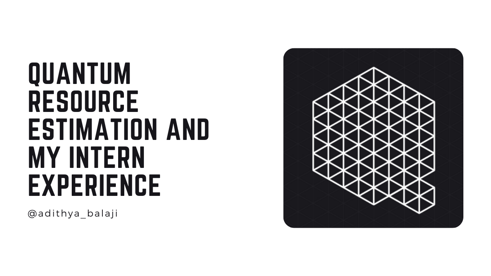

<!-- markdownlint-capture -->
<!-- markdownlint-disable -->
<iframe loading="lazy" width="100%" height="166" scrolling="no" frameborder="no" allow="autoplay" src="https://w.soundcloud.com/player/?url=https%3A//api.soundcloud.com/tracks/1180461799&color=%23ff5500&auto_play=false&hide_related=false&show_comments=true&show_user=true&show_reposts=false&show_teaser=true"></iframe><div style="font-size: 10px; color: #cccccc;line-break: anywhere;word-break: normal;overflow: hidden;white-space: nowrap;text-overflow: ellipsis; font-family: Interstate,Lucida Grande,Lucida Sans Unicode,Lucida Sans,Garuda,Verdana,Tahoma,sans-serif;font-weight: 100;"><a href="https://soundcloud.com/adithyabsk" title="Adithya" target="_blank" style="color: #cccccc; text-decoration: none;">Adithya</a> · <a href="https://soundcloud.com/adithyabsk/microsoft" title="Quantum Resource Estimation and my Intern Experience" target="_blank" style="color: #cccccc; text-decoration: none;">Quantum Resource Estimation and my Intern Experience</a></div>
<!-- markdownlint-restore -->

This past summer, I worked on the Quantum Systems Team at Microsoft. Every
December the group puts together a
[Q# Advent Calendar](https://devblogs.microsoft.com/qsharp/q-advent-calendar-2021/)
filled with great blog posts. I thought I'd share my work on the Quantum Systems
Team, as well as my general experience being a Microsoft Intern.

## Quantum Resource Estimation

### Motivation

Resource estimation is an important concept in quantum programs. As the name
implies, resource estimation allows a quantum researcher to understand the
simulated resources required to run a particular algorithm, usually measured in
logical qubits. But resource estimation can provide much more than that. We can
track the number and types of gates required to run a program. And, by
continuously evaluating a quantum program against a common set of metrics, we
can understand the improvement of our theoretical approaches.

### Toy Example

To be more concrete, we can look at the outputs of the QDK Resource Estimation
tool on various Q# implementations of quantum programs that implement the
following function, where $n=3$. (known as the
[majority of three](https://en.wikipedia.org/wiki/Majority_function)
) This example is taken from a great presentation given by the QDK Team at
[IEEE Quantum Week 2020](https://qce20.quantum.ieee.org/tutorials/).

&nbsp;

$$\begin{split}
\langle p_1,\dots, p_n \rangle &= \rm Majority (p_1, \dots, p_n) \\
\\
&= \left \lfloor \frac{1}{2} + \frac{((\sum^n_{i=1} p_i) - 1/2}{n} \right \rfloor
\end{split}$$

&nbsp;

```csharp
namespace Majority {
    open Microsoft.Quantum.Canon;
    open Microsoft.Quantum.Convert;
    open Microsoft.Quantum.Intrinsic;
    open Microsoft.Quantum.Synthesis;

    operation ApplyMajorityUsingInts(x1 : Qubit, x2: Qubit, x3 : Qubit,
    y : Qubit) : Unit is Adj + Ctl {
        ...
    }


    operation ApplyMajorityUsingCCNOTs(x1 : Qubit, x2: Qubit, x3 : Qubit,
    y : Qubit) : Unit is Adj + Ctl {
        ...
    }

    operation ApplyMajorityUsingTruthTable(x1 : Qubit, x2: Qubit, x3 : Qubit,
    y : Qubit) : Unit is Adj + Ctl {
        ...
    }

    operation ApplyMajorityUsingCNOTTransformation(x1 : Qubit, x2: Qubit,
    x3 : Qubit, y : Qubit) : Unit is Adj + Ctl {
        ...
    }

}
```

We won't dive into the implementation details of each of these functions since
that is not the focus of this blog post. (and, they were
[already covered in the talk linked above](https://www.youtube.com/watch?v=Ps5lZ0G6zIg)
) What is important, though, is that they _do_ produce
significantly different qubit usage counts and gate counts as noted in the table
below.

|     Implementation          |     CNOT    |     Clifford    |     T     |     T   Depth    |     Qubits    |
|-----------------------------|-------------|-----------------|-----------|------------------|---------------|
|     Ints                    |     120     |     30          |     84    |     56           |     5         |
|     CCNOTs                  |     30      |     6           |     21    |     15           |     4         |
|     Truth Table             |     14      |     3           |     8     |     6            |     4         |
|     CCNOT Transformation    |     15      |     2           |     7     |     5            |     4         |

Now imagine you are a researcher trying to iteratively improve upon your
algorithm's performance. Often times, performance in one of these metrics comes
at the cost of another area. (known as a [Pareto front](https://en.wikipedia.org/wiki/Pareto_front)
) And after speaking with quantum researchers, I noted that they all mention the
tedium and sometimes error filled process of tracking experiment results.

### Approach

Enter the resource estimation dashboard, an all-in-one tool to both measure and
track the performance of different quantum programs. The idea here is to track
experiment results using a consistent format and upload the results to a central
platform. As you iteratively improve on your algorithm--or run your algorithm
with a different set of parameters, you will see plots that result in points
along a Pareto curve.

The screenshot below is taken from the MVP that I built over the summer. It
digitizes the main plots showing the tradeoffs suggested in the work to
[reduce the T-Depth of quantum circuits](https://arxiv.org/pdf/2006.03845.pdf).
One could imagine a website with this page, along with others pages, for
specific quantum applications covered in the
[Quantum Algorithm Zoo](https://quantumalgorithmzoo.org/). In fact, you get a
two for one, since both the results and code are collated together, you get
reproducibility of results for free. (that is, if the project was run using a
public CI service like GitHub Actions)


In fact, this concept is not all that new and has been put to great effect in the
ML community and [a number](https://wandb.ai/site)
[of startups](https://neptune.ai/)
[and projects](https://github.com/IDSIA/sacred) [are working](https://web.archive.org/web/20211205032107/https://www.comet.ml/site/)
on problems in that space. [Papers with Code](https://paperswithcode.com/),
most notably, has become the go-to source for ML researchers to get a rough
sense of the progression of the state of the art in any particular problem area.
The work I implemented over the summer put together an MVP for a hosted runner
that executed [Q# programs](https://github.com/microsoft/QuantumLibraries)
against the open source [QDK Resource Estimator](https://docs.microsoft.com/en-us/azure/quantum/user-guide/machines/resources-estimator).
For those curious, the stack was a Next.js frontend with a .NET API backend
server. The above is just a sample of the overall project vision, and I hope
gives you an idea of the types of exciting work the Quantum Systems team is
working on.

## The Microsoft Intern Experience

Besides my core work on the Quantum Systems Team, I also enjoyed
my time as a Microsoft Intern! Although there were a number of fantastic intern
events, two in particular, stand out in my memory: the
[Microsoft Intern Game](https://interngame.microsoft.com/) and serving as a
moderator for a "pool-side" chat with a Microsoft Researcher.

For the intern game, we paired up into groups and competed in an "Amazing Race"
style virtual event with a Casino Heist theme. The Microsoft team behind the
event had developed a custom virtual platform with mini-games that had real
world puzzles that were mailed out to us along with actors, to boot. It was a
great time. For my moderation panel, I got a chance to chat with [Kevin Yang](https://www.linkedin.com/in/kevinkyang)
a senior researcher working on bioinformatics in Microsoft's Cambridge office.
We chatted about his past as a PhD student and his current work at Microsoft
along with why he's excited about protein engineering. Besides the events, the
intern team was very kind to send the interns a lot of swag--some of which I
wear all the time like my quantum team sweatshirt.

Overall, I cannot speak more highly about my experience as an intern on the
Quantum Team and--
[I hear they are looking for more interns](https://devblogs.microsoft.com/qsharp/interning-at-microsoft-quantum-2022/),
so I would definitely recommend you check them out.
